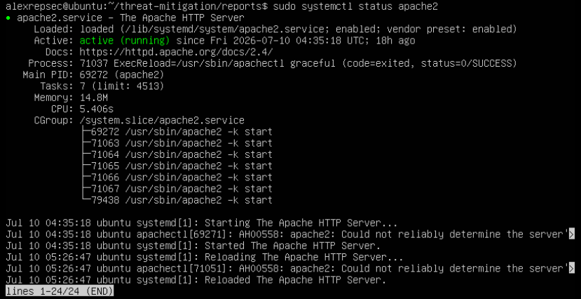
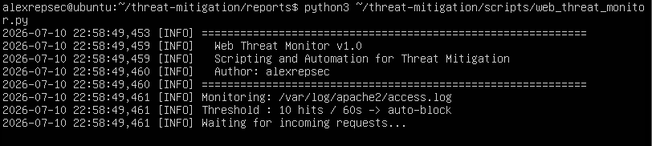
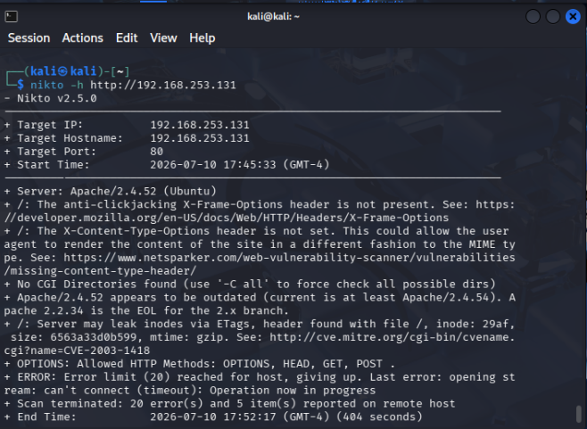
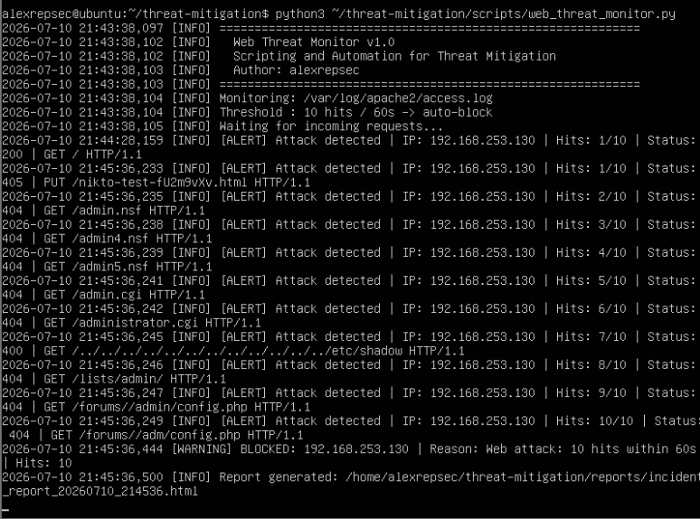
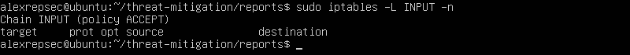
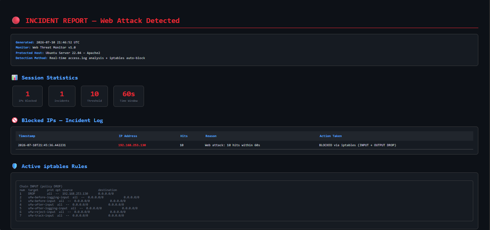

# 🛡️ Scripting and Automation for Threat Mitigation


> Automated web attack detection, IP blocking via iptables, and HTML incident report generation — demonstrated in a controlled VMware lab environment.

---

## 📋 Table of Contents

- [Overview](#overview)
- [Lab Environment](#lab-environment)
- [Attack Scenario](#attack-scenario)
- [Project Structure](#project-structure)
- [How It Works](#how-it-works)
- [Scripts](#scripts)
- [Lab Walkthrough](#lab-walkthrough)
- [Results](#results)
- [Skills Demonstrated](#skills-demonstrated)

---

## Overview

This project demonstrates a real-world **threat mitigation pipeline** built with Python and Bash. A web server running on Ubuntu Server 22.04 is attacked by a Kali Linux machine using **Nikto** (a web vulnerability scanner). A custom Python monitor detects the attack in real time by analyzing Apache access logs, automatically blocks the attacker's IP using **iptables**, and generates a detailed **HTML incident report**.

The entire detection-to-block cycle completed in under 60 seconds with zero manual intervention.

---

## Lab Environment

| Role | OS | IP Address | Tool |
|------|----|------------|------|
| 🟢 Defender / Victim | Ubuntu Server 22.04 | 192.168.253.131 | Apache2, Python3, iptables, UFW |
| 🔴 Attacker | Kali Linux | 192.168.253.130 | Nikto v2.5.0 |

**Virtualization:** VMware Workstation — NAT Network  
**Network:** Both machines on the same NAT subnet (192.168.253.0/24)

```
┌─────────────────────────────────────────────────────────┐
│                    VMware NAT Network                   │
│                   192.168.253.0/24                      │
│                                                         │
│   ┌──────────────────┐       ┌──────────────────────┐   │
│   │   Kali Linux     │       │   Ubuntu Server      │   │
│   │ 192.168.253.130  │──────▶│   192.168.253.131    │   │
│   │                  │ Nikto │                      │   │
│   │  [ATTACKER]      │ scan  │  Apache2 :80         │   │
│   └──────────────────┘       │  Python Monitor      │   │
│                              │  iptables            │   │
│                              │  [DEFENDER]          │   │
│                              └──────────────────────┘   │
└─────────────────────────────────────────────────────────┘
```

---

## Attack Scenario

**Threat:** Web reconnaissance and vulnerability scanning using Nikto  
**Attack Vector:** HTTP — Port 80  
**Techniques Detected:** Path traversal, admin panel enumeration, `/etc/shadow` access attempts, CGI probing, outdated server fingerprinting

**Attack command launched from Kali:**
```bash
nikto -h http://192.168.253.131
```

**Automated defense pipeline on Ubuntu:**
```
Apache access.log → Python Monitor → Pattern Match → Hit Counter → iptables DROP → HTML Report
```

---

## Project Structure

```
threat-mitigation/
│
├── scripts/
│   ├── python/
│   │   └── web_threat_monitor.py     # Core detection, blocking & reporting engine
│   └── bash/
│       └── setup.sh                  # Environment setup script
│
├── assets/
│   ├── 01_apache_running.png
│   ├── 02_monitor_running.png
│   ├── 03_nikto_scan.png
│   ├── 04_monitor_detecting.png
│   ├── 05_iptables_blocked.png
│   └── 06_incident_report.png
│
├── reports/                          # Auto-generated HTML incident reports
│   └── incident_report_YYYYMMDD_HHMMSS.html
│
├── logs/
│   ├── monitor.log                   # Runtime monitor log
│   └── blocked_ips.json              # Persistent blocked IP records
│
└── README.md
```

---

## How It Works

### Detection Engine (`web_threat_monitor.py`)

The monitor tails `/var/log/apache2/access.log` in real time and checks every incoming request against a library of **26 attack signatures** covering:

| Category | Signatures |
|----------|-----------|
| Scanner fingerprints | `nikto`, `curl`, `wget`, `python-requests` |
| SQL Injection | `select.*from`, `union.*select`, `insert.*into`, `drop.*table` |
| XSS | `<script`, `javascript:`, `alert(`, `onerror=`, `onload=` |
| Path Traversal | `../`, `/etc/passwd`, `/etc/shadow`, `/proc/self` |
| Admin Enumeration | `/wp-admin`, `/phpmyadmin`, `/admin`, `/config.` |
| Command Injection | `cmd=`, `exec(`, `base64_decode` |
| Sensitive Files | `.env`, `.git/`, null byte `%00` |
| Remote File Inclusion | `.php?.*=http` |

### Blocking Logic

```
Hit detected → increment counter for source IP
If hits >= 10 within 60 seconds:
    → iptables -I INPUT  -s <IP> -j DROP
    → iptables -I OUTPUT -d <IP> -j DROP
    → Log incident to blocked_ips.json
    → Generate HTML incident report
```

### Report Generation

Every block event triggers automatic generation of an HTML incident report containing:
- Session statistics (IPs blocked, incidents, threshold config)
- Full incident log table (timestamp, IP, hits, reason, action)
- Live snapshot of active iptables rules

---

## Scripts

### `scripts/python/web_threat_monitor.py`
Core monitoring engine. Runs continuously on the defender machine.

**Key parameters (configurable at top of script):**
```python
THRESHOLD      = 10    # hits before blocking
TIME_WINDOW    = 60    # seconds to count hits within
CHECK_INTERVAL = 2     # seconds between log reads
LOG_FILE       = "/var/log/apache2/access.log"
```

**Run:**
```bash
python3 scripts/python/web_threat_monitor.py
```

---

### `scripts/bash/setup.sh`
Automates the full environment setup on Ubuntu Server: installs Apache2 + PHP, configures log permissions, sets up the sudoers rule for iptables, and creates the project directory structure.

**Run:**
```bash
chmod +x scripts/bash/setup.sh
sudo bash scripts/bash/setup.sh
```

---

## Lab Walkthrough

### Step 1 — Apache running on Ubuntu (Defender)



Apache2 is active and running on Ubuntu Server 22.04, serving the target web application on port 80.

---

### Step 2 — Monitor started on Ubuntu



The Python monitor initializes, begins tailing the Apache access log, and waits for incoming requests. Threshold is set to 10 hits within 60 seconds before auto-blocking.

---

### Step 3 — Nikto scan launched from Kali (Attacker)



Nikto v2.5.0 performs a full web vulnerability scan against the target. It probes for outdated server versions, missing security headers, exposed admin panels, and known CVEs. The scan triggered 20+ error attempts across multiple attack vectors.

---

### Step 4 — Monitor detects and blocks the attack



The monitor detects each malicious request in real time. After 10 hits within the 60-second window, the attacker IP `192.168.253.130` is automatically blocked via iptables. The block event triggers immediate report generation.

```
[WARNING] BLOCKED: 192.168.253.130 | Reason: Web attack: 10 hits within 60s | Hits: 10
[INFO]    Report generated: incident_report_20260710_214536.html
```

---

### Step 5 — iptables rule confirmed



The iptables INPUT chain confirms the DROP rule was applied for the attacker's IP, blocking all further communication from that host.

---

### Step 6 — HTML Incident Report



An HTML incident report is auto-generated with full attack details, session statistics, and a live snapshot of active iptables rules.

---

## Results

| Metric | Value |
|--------|-------|
| Attack tool | Nikto v2.5.0 |
| Attacker IP | 192.168.253.130 |
| Requests to trigger block | 10 |
| Time to detection | < 5 seconds |
| Time to block | < 60 seconds |
| Block method | iptables INPUT + OUTPUT DROP |
| Report generated | Automatically on block event |
| Manual intervention required | ❌ None |

---

## Skills Demonstrated

- **Python scripting** — real-time log parsing, regex pattern matching, subprocess automation
- **Linux firewall management** — iptables rule injection via Python subprocess
- **Log analysis** — Apache access log monitoring with tail-follow implementation
- **Threat detection** — signature-based detection engine with rate limiting
- **Incident reporting** — automated HTML report generation
- **Network security** — UFW configuration, NAT lab environment setup
- **Offensive tools** — Nikto web vulnerability scanner (attack simulation)

---

> ⚠️ **Disclaimer:** This project was conducted in an isolated VMware lab environment for educational purposes only. All attack simulations were performed on systems owned and controlled by the author.

---

> ## 👤 Author
 
**alexrepsec**  
Cybersecurity enthusiast | Home Lab Builder
 
*This project was built as part of a cybersecurity portfolio to demonstrate practical SOC automation and analyst skills.*
 

---
